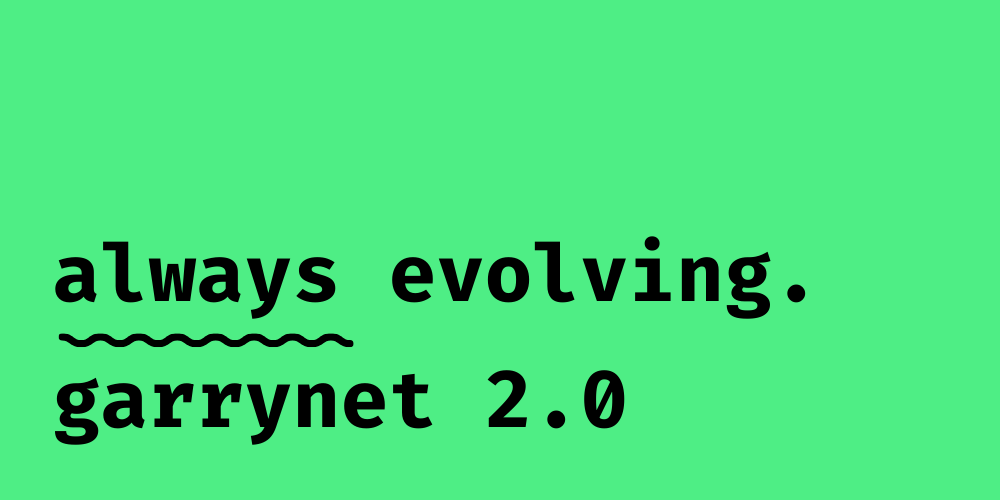

# garrynet 2.0

## Description

My personal website, powered by static-site generator Hugo.

## License

-   **Code**: Licensed under the [MIT License](./LICENSE).
-   **Content**: Licensed under [CC BY-NC 4.0](./LICENSE-CONTENT).

> You may share and adapt the content with attribution, but **commerical use is not allowed**.
